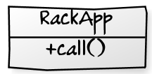
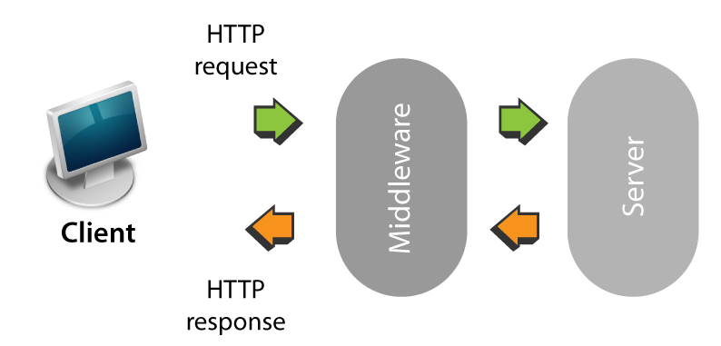
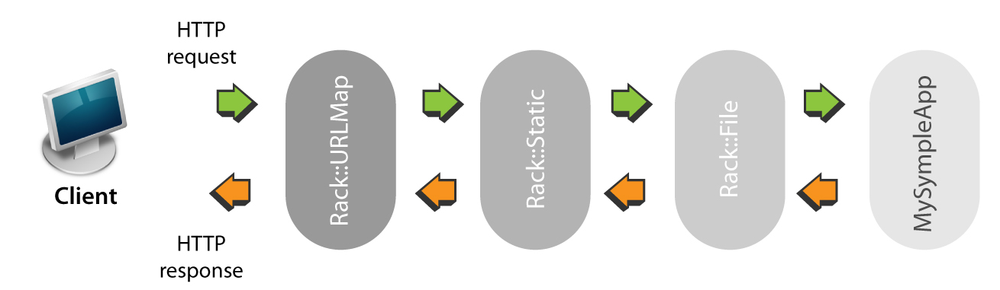

!SLIDE 
# Your best friend *Rack* #

!SLIDE bullets incremental
# What is Rack? #

* > Rack provides a minimal interface between webservers supporting Ruby and Ruby frameworks.
* Transparently integrates in your existing rails, sinatra apps
* Helps you easily create a middleware standalone application stack

!SLIDE bullets incremental
# Yeah! but... what is Rack? #
* A Rack application is a *Ruby object* that responds to *call*. It takes exactly *one argument*, *the environment* and *returns* an *Array* of exactly *three values*: The *status*, the *headers*, and the *body*. 

!SLIDE bullets incremental full-page
# A basic Rack app diagram #

!SLIDE
# Minimum server interface you said? #
    @@@ ruby
    app = lambda do |env| 
      [200, 
        { 'Content-Type' => 'text/html' }, 
       'Hello World']
    end
    run app 

!SLIDE bullets incremental full-page
# Where does Rack sit? #

!SLIDE bullets incremental
# Rack is a full middleware stack #

!SLIDE bullets incremental full-page
# Allows a modular design  #

!SLIDE bullets incremental
# What is a *middleware*? #
* > Rack application that is *designed* to *run* in *conjunction* with another Rack application, which acts as the *endpoint*

!SLIDE bullets incremental
# ... #
* Think of a Rack middleware as a filter *receiving* the Rack environment for the request from the previous *middleware*
* Does some work with or on the *request's environment*
* Then *calls* the *next middleware* in the chain

!SLIDE bullets incremental
# ... #
* > The *last* Rack application in the chain is the *application itself*
* *Any* middleware in the chain can *return the Rack response itself*, thus *preventing* the rest of the middlewares in the chain from *executing*
