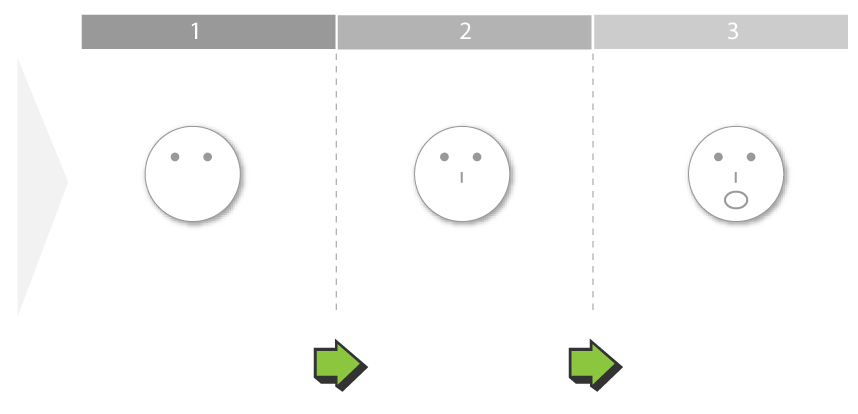
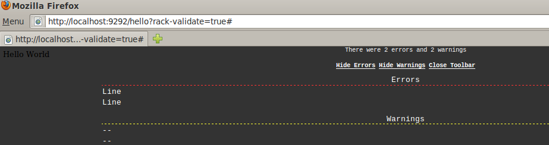

!SLIDE commandline incremental
# Installation #
    ... $ gem install rack
    Successfully installed rack-1.2.1
    1 gem installed
    Installing ri documentation for rack-1.2.1...
    Building YARD (yri) index for rack-1.2.1...
    Installing RDoc documentation for rack-1.2.1...

!SLIDE
# Let's talk more Rack #
    @@@ ruby
    status, headers, body = object.call

    [200, 
      { 'Content-Type' => 'text/html' }, 
      'Hello World']

!SLIDE
# Stacking apps #
    @@@ ruby
    module MyModule
      class Upcase
        def initialize app 
          @app = app 
        end 
       
        def call env 
          p 'upcase'
          status, headers, body = @app.call env 
          [status, headers, [body.first.upcase]]
        end 
      end 
    end

!SLIDE
# ... #
    @@@ ruby
    module MyModule
      class Reverse
        def initialize app 
          @app = app 
        end 
       
        def call env 
          p 'reverse'
          status, headers, body = @app.call env 
          [status, headers, [body.first.reverse]]
        end 
      end 
    end

!SLIDE
# ... #
    @@@ ruby
    use MyModule::Upcase
    use MyModule::Reverse
    use Rack::ContentLength

    app = lambda { |env| [200, { 'Content-Type' => 'text/html' }, 'Hello World'] }
    run app 

!SLIDE commandline incremental
# ... #
    ...$ rackup stacked1.ru &
    [1] 2123
    ...$ curl localhost:9292
    "upcase"
    "reverse"
    127.0.0.1 - - [03/Nov/2010 16:15:34] "GET / HTTP/1.1" 200 11 0.0012
    DLROW OLLEH
    ...$ 

!SLIDE bullets incremental
# What happened? #
* A *Decorator pattern* happens
* > In *OOP*, the *decorator pattern* is a *design pattern* that allows *new/additional* *behaviour* to be added to an existing object *dynamically*

!SLIDE bullets incremental full-page

!SLIDE bullets incremental
# Basic API #
* *use(middleware, **args, &block)* adds a middleware to the stack
* *run(app)* dispatches to an application
* *map(path, &block)* constructs a Rack::URLMap in a convenient way

!SLIDE bullets incremental
# Basic API - usage example #
    @@@ ruby
    require 'rack-validate'

    use Rack::Validate

    map '/hello' do
      run lambda do |env| 
        [200, 
          { 'Content-Type' => 'text/html' }, 
          'Hello World']
      end
    end

!SLIDE bullets incremental full-screen
# [Rake::Validate](http://coderack.org/users/nerdEd/middlewares/95-rackvalidate) from [http://coderack.org/](http://coderack.org/) #

!SLIDE bullets incremental
# Basic optional usage - Rack::Builder #
## Provides an optional DSL ##
    @@@ ruby
    app = Rack::Builder.new do
      map "/hello" do
        run lambda do |env| 
          [200, 
            { 'Content-Type' => 'text/html' }, 
            'Hello World'] 
        end
      end
    end

!SLIDE bullets incremental
# Rack convenience #
* Wanna *develop outside of existing frameworks*, implement *your own ones*, or *develop middleware*?
* Rack provides many *helpers* to create Rack applications quickly and without doing the same web stuff all over

!SLIDE bullets incremental
## Rack::Request  ##
    @@@ ruby
    req = Rack::Request.new(env)
    req.post?
    req.params["data"]

!SLIDE bullets incremental
## Rack::Response  ##
    @@@ ruby
    res = Response.new
    res.write "<title>Lobstericious!</title>"
    res.write "<pre>"
    res.write lobster
    res.write "</pre>"
    res.write "
<a href='#{href}'>flip!</a>
"
    res.write "
<a href='?flip=crash'>crash!</a>
"
    res.finish

!SLIDE commandline incremental smaller
## use Rack::CommonLogger  ##
### Writes a log statement to STDOUT in the Apache common log format for each request ###

## use Rack::ShowExceptions ##
### Renders a nice looking errors page for all unhandled exceptions ###

## use Rack::Lint ##
### Ensures that your Rack application conforms to the Rack spec. Rack::Lint will generate an exception if the response of your application does not meet the Rack spec ###

!SLIDE bullets incremental
## And many more ##
* Rack::Auth::Basic
* Rack::Session::Cookie
* Rack::Sendfile
* [http://coderack.org/](http://rack.rubyforge.org/doc/)
* [http://rack.rubyforge.org/doc/](http://rack.rubyforge.org/doc/)
